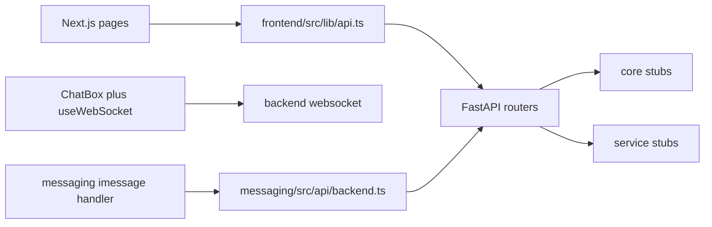

# Architecture

nyc-companion is three processes plus a SQL schema. They share hello-world data and do not require Postgres or provider API keys to start.

## frontend

Next.js App Router in `frontend/src/app`. Discover, Navigate, and Profile read JSON from the API. Assistant opens a WebSocket at `/ws`. `frontend/src/lib/api.ts` is the HTTP client.

## backend

`backend/app/main.py` mounts the routers and `GET /health`. Routers call `backend/app/core`. Core calls service stubs in `backend/app/services`. SQLAlchemy models in `backend/app/models` match `database/schema.sql`. `backend/app/db/database.py` creates an engine only when `DATABASE_URL` is set. Hello-world routes do not open a connection.

### Where backend code belongs

| Location | Responsibility | Existing examples |
| --- | --- | --- |
| `app/main.py` | Create the application, configure middleware, register routers | FastAPI, CORS, health endpoint |
| `app/api/` | Handle HTTP requests and WebSocket connections | `assistant.py`, `discover.py`, `trips.py`, `users.py`, `websocket.py` |
| `app/core/` | Coordinate application behavior | `citypilot.py`, `recommendations.py`, `personalization.py` |
| `app/services/` | Wrap external provider APIs and their current stubs | Grok, Backboard, ElevenLabs, maps, NYC Open Data |
| `app/models/` | Describe persisted entities with SQLAlchemy | User, preference, place, trip |
| `app/schemas/` | Validate and describe API request and response data with Pydantic | Assistant messages, places, trips, user profiles |
| `app/db/` | Manage connections and database access | `database.py`, reserved `repositories/` package |
| `app/config.py` | Read environment settings | Database URL, CORS origins, provider keys |
| `tests/` | Exercise backend behavior | `test_health.py` checks health and discovery |

Keep request handling in `api/`, application decisions in `core/`, and provider-specific calls in `services/`. Put future database queries in `db/repositories/`. SQL schema changes, seed data, and migrations belong in the root `database/` directory; keep them consistent with `app/models/`.

## messaging

`messaging/src/index.ts` checks backend health, then turns a sample iMessage into `POST /api/assistant/chat`. Photon and Spectrum SDKs are not imported, so the process starts without them.

## database

`database/schema.sql` defines users, preferences, places, and trips. `database/seed.sql` inserts one row of each. `database/migrations/` is reserved for later migrations.

## Package boundaries

Frontend routes and layouts belong in `frontend/src/app/`, reusable UI in `frontend/src/components/`, browser hooks in `frontend/src/hooks/`, and API helpers and TypeScript contracts in `frontend/src/lib/`.

Messaging event adapters belong in `messaging/src/handlers/`, backend HTTP calls in `messaging/src/api/`, and process startup in `messaging/src/index.ts`. Both frontend and messaging communicate with the backend over HTTP or WebSocket; database access belongs in the backend.

Each package owns its dependency manifest and environment template. The root `.env.example` indexes those templates. Architecture, API contracts, and demo instructions belong in `docs/`.
